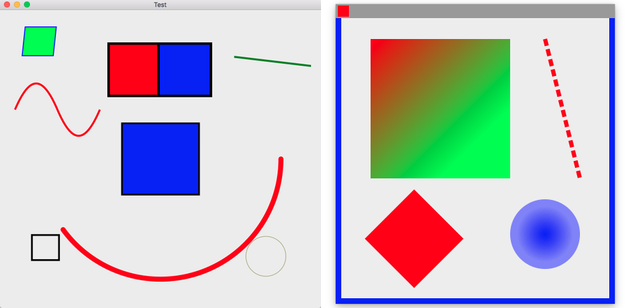

# Area

> A canvas you can draw on.



UiArea provide a canvas you can draw on. It also receives keyboard and mouse events, supports scrolling, is DPI aware, and has several other useful features.

```js
var libui = require('libui');
var colorDodgerBlue = 0x1E90FF;
var uiDrawFillModeWinding = 0;
libui.Ui.init();
var win = new libui.UiWindow('UiEntry example', 640, 480, true);

var handler = {
	draw: function draw(area, p) {
		// draw a filled rectangle with dodger blue color
		var brush = buildSolidBrush(colorDodgerBlue, 1.0);
		var path = new libui.UiDrawPath(uiDrawFillModeWinding);
		path.addRectangle(0, 0, p.getAreaWidth(), p.getAreaHeight());
		path.end();
		p.getContext().fill(path, brush);
		path.freePath();
	},
	mouseEvent: function () {},
	mouseCrossed: function () {},
	dragBroken: function () {},
	keyEvent: function () {}
};

var widget = new libui.UiArea(handler);

win.setChild(widget);

win.onClosing(function () {
	win.close();
	libui.stopLoop();
});

win.show();

libui.startLoop();
```

# Drawing concepts

## The Area Handler

A UiArea is driven by an *area handler*. An area handler is an object with several methods that UiArea calls to do certain tasks. To create an area handler, simply have an object that implements following methods:

```js
var handler = {
	draw: function draw(area, p) {

	},
	mouseEvent: function () {

	},
	mouseCrossed: function () {

	},
	dragBroken: function () {

	},
	keyEvent: function () {

	}
}
```

## Drawing

Unlike drawing canvas controls in other toolkits, UiArea does **not** have a fixed size. The coordinate (0, 0) is always the top-left corner of the drawing area, regardless of how big the uiArea is in the current window or where the scrollbars presently are. Instead, you simulate a size by setting the scrollbar bounds, and you are given the current scrolling positions to base your drawing with.

The visible drawing area is called the *content area* by the drawing machinery.

When a part of the UiArea needs to be redrawn, the area handler's `draw()` method is called. It receives the UiArea instance and an UiAreaDrawParams object with parameters necessary for drawing.

```js
class UiAreaDrawParams {
	context: UiDrawContext;

	contentWidth: Number;
	contentHeight: Number;

	hscrollpos: Number;
	vscrollpos: Number;

	clipX: Number;
	cilpY: Number;
	clipWidth: Number;
	clipHeight: Number;

	dpiX: Number;
	dpiY: Number;
};
```

`context` is the drawing context; see [UiDrawContext](#UiDrawContext) for details.

`contentWidth` and `contentHeight` are the current width and height of the content area. `hscrollpos` and `vscrollpos` are the current horizontal and vertical positions of the scrollbars, in units defined by the scrollbar configurations; see below.

`clipX`, `clipY`, `clipWidth`, and `clipHeight` define a rectangle, in content area coordinates, that the OS has requested to be redrawn. You can use this to optimize your drawing by only drawing where drawing is needed; the OS may choose to drop any drawing done outside the clip rectangle.

`dpiX` and `dpiY` are the uiArea's current DPI in the X and Y directions, respectively. Do not save these values; they are not guaranteed to stay the same once `draw()` returns.

## The Coordinate System and Points

In the traditional way we think of drawing, we think of rendering onto a plane of pixels. The pixels have a fixed size, and coordinates refer to the entire space that a pixel occupies.

When we say "draw a line from (0, 0) to (5, 5) exclusive", we mean "fill the spaces that are occupied by the pixels at (0, 0), (1, 1), (2, 2), (3, 3), and (4, 4)".

But now let's pretend we're working in a coordinate system where the point at (x, y) corresponds strictly to the top-left corner of the area that a pixel occupies.

In this model, when we say "draw a line from (0, 0) to (5, 5)", we mean "draw a straight line filling every pixel that we cross if we traced a line from the top-left corner of what we used to call the pixel at (0, 0 to the top-left corner of what we used to call the pixel at (5, 5)".

There are both technical and non-technical reasons for following this model. The technical reason is that implementing certain drawing operations, such as filling shapes, is much easier if we do things this way. The [cairo FAQ](http://www.cairographics.org/FAQ/#sharp_lines) explains in more detail. The non-technical reason has to do with DPI independence.

## DPI Independence vs. DPI Awareness

An upcoming trend in computing is the high-resolution display. These displays fit more dots in the same area that older screens could. The conventional term for the number of dots that fit in a given area is the "dots per inch", or DPI, measure.

A naive approach to writing programs for these new displays is to think "well, if I just take the DPI and only use it in calculations where I need to deal with real-world measurements such as inches, rendering pure pixels as I always have, I should be fine". This kind of design is centered around *DPI awareness*. I know, I used to believe this too. But here's a little secret: this is wrong! A common myth about high-resolution monitors among non-technical people is that it makes the stuff on screen smaller.

Instead, what we want out of a high-resolution display is *to show a more detailed view of the same image in the same space*. [The first image on Apple's discussion of the topic](https://developer.apple.com/library/mac/documentation/GraphicsAnimation/Conceptual/HighResolutionOSX/Art/backing_store_2x.png) is the perfect example. On the left, you see a low-resolution monitor. Notice how big chunks of the shapes go into the boxes. When the code that maps points to pixels runs, it can't have two colors in one square, so it has to decide what color to use.

# Classes
---

# UiDrawContext

> The UiDrawContext class is used for drawing rectangles, text, images and other objects onto the UiArea widget. It provides the 2D rendering context for the drawing surface of a UiArea widget.

To get an object of this interface, use the `getContext` method of the `UiAreaDrawParams` argument you receive in your handler `draw` method:

```js
	function draw(area, p) {
		var context = p.getContext();
	}
```

## Methods

### stroke

Draw a path in the context.

**Arguments**

* path: UiDrawPath - the path to use for the operation.
* brush: DrawBrush - the brush to use for the operation.
* params: DrawStrokeParams - define the kind of line to use.


### fill

Draw a path filled with a color.

**Arguments**

* path: UiDrawPath - the path to use for the operation.
* brush: DrawBrush - the brush to use for the operation.

### transform

Apply a different transform matrix to the context.

**Arguments**

* matrix: UiDrawMatrix - the matrix to apply.

### clip

Clip a path from the context

**Arguments**

* path: UiDrawPath - the path to use for the operation.

### save

Save the trasformations currently applyed to the context.

### restore

Restore previously saved trasformations of the context.

### text

Draws a given text at the given (x,y) position.

* x: Number - the horizontal position at which to draw the text.
* y: Number - the vertical position at which to draw the text.
* layout: DrawTextLayout - the text to draw, complete with font and color information.


# UiDrawPath

> Represent a path that could be drawed on a UiDrawContext

## Constructor

**Arguments**

* fillMode: UiDrawFillMode

An application fills the interior of a path using one of two fill modes: alternate or winding. The mode determines how to fill and clip the interior of a closed figure.

The default mode is Alternate. To determine the interiors of closed figures in the alternate mode, draw a line from any arbitrary start point in the path to some point obviously outside the path. If the line crosses an odd number of path segments, the starting point is inside the closed region and is therefore part of the fill or clipping area. An even number of crossings means that the point is not in an area to be filled or clipped. An open figure is filled or clipped by using a line to connect the last point to the first point of the figure.

The Winding mode considers the direction of the path segments at each intersection. It adds one for every clockwise intersection, and subtracts one for every counterclockwise intersection. If the result is nonzero, the point is considered inside the fill or clip area. A zero count means that the point lies outside the fill or clip area.
A figure is considered clockwise or counterclockwise based on the order in which the segments of the figure are drawn.


## Methods

### freePath

Dispose a path object.

### newFigure

Starts a new figure at the specified point. Call this method when you want to create a new path.

**Arguments**

* x: Number
* y: Number

### newFigureWithArc

Starts a new figure and adds an arc to the path which is centered at (`xCenter`, `yCenter`) position with radius `radius` starting at `startAngle` and with sweep angle `sweep` going in the given direction by anticlockwise (defaulting to clockwise) as specified by `negative`.

**Arguments**

* xCenter: Number
* yCenter: Number
* radius: Number
* startAngle: Number
* sweep: Number
* negative: Boolean

### lineTo

Connects the last point in the subpath to the x, y coordinates with a straight line.

**Arguments**

* x: Number
* y: Number


### arcTo

Adds an arc to the path which is centered at (`xCenter`, `yCenter`) position with radius `radius` starting at `startAngle` and with sweep angle `sweep` going in the given direction by anticlockwise (defaulting to clockwise) as specified by `negative`.

**Arguments**

* xCenter: Number
* yCenter: Number
* radius: Number
* startAngle: Number
* sweep: Number
* negative: Boolean


### bezierTo

Adds a cubic Bézier curve to the path. It requires three points. The first two points are control points and the third one is the end point. The starting point is the last point in the current path.

**Arguments**

* c1x: Number
* c1y: Number
* c2x: Number
* c2y: Number
* endX: Number
* endY: Number

### addRectangle

Creates a path for a rectangle at position (x, y) with a size that is determined by width and height.

**Arguments**

* x: Number
* y: Number
* width: Number
* height: Number

### end

End the path leaving the figure open.

### closeFigure

Causes the point of the pen to move back to the start of the current sub-path. It tries to draw a straight line from the current point to the start. If the shape has already been closed or has only one point, this function does nothing.

It end the path.
