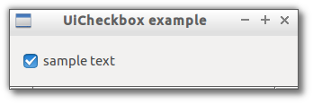

# Checkbox

> A checkbox widget.



```js

var libui = require('libui');

libui.Ui.init();
var win = new libui.UiWindow('UiCheckbox example', 640, 480, true);

var widget = new libui.UiCheckbox();
win.setChild(widget);

win.onClosing(function () {
	win.close();
	libui.stopLoop();
});

win.show();

libui.startLoop();

```

---

# Constructor

> new libui.UiCheckbox()

Create a new UiCheckbox object.

---

# Properties

See [properties implementation](properties.md) for generic details on how properties are implemented.


### visible: Boolean

Whether the widget should be visible or hidden. 
Read write.
Defaults to `true`.


### enabled: Boolean

Whether the widget should be enabled or disabled. 
Read write.
Defaults to `true`.


### checked: Boolean

Whether the checkbox is checked or unchecked.
Read write.
Defaults to false


### text: String

The static text of the button.
Read write.


---

# Methods


## destroy

Destroy and free the control.


## setParent

Change the parent of the control


### Arguments

* parent: UiControl - the new parent of the widget or null to detach it.


## toplevel

Return whether the control is a top level one or not.


---

# Events

See [events implementation](events.md) for generic details on how events are implemented.


### onToggled

Emitted whenever property `checked` change.


