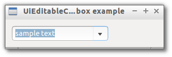

# EditableCombobox

> A drop down combo box that allow selection from list or free text entry.



```js

var libui = require('libui');

libui.Ui.init();
var win = new libui.UiWindow('UiEditableCombobox example', 640, 480, true);

var widget = new libui.UiEditableCombobox();
win.setChild(widget);

win.onClosing(function () {
	win.close();
	libui.stopLoop();
});

win.show();

libui.startLoop();

```

---

# Constructor

> new libui.UiEditableCombobox()

Create a new UiEditableCombobox object.

---

# Properties

See [properties implementation](properties.md) for generic details on how properties are implemented.


### visible: Boolean

Whether the widget should be visible or hidden. 
Read write.
Defaults to `true`.


### enabled: Boolean

Whether the widget should be enabled or disabled. 
Read write.
Defaults to `true`.


### text: String

Return or set the current selected text or the text value of the selected item in the list.


---

# Methods


## append

Append a new text item to the drop down list.


**Arguments**

* text: String - the text item to append.


## destroy

Destroy and free the control.


## setParent

Change the parent of the control


**Arguments**

* parent: UiControl - the new parent of the widget or null to detach it.


## toplevel

Return whether the control is a top level one or not.


## setVisible

Set the value of property `visible`

**Arguments**

* value: Boolean - The new value for `visible` property.

## getVisible

Return the value of property `visible`


## setEnabled

Set the value of property `enabled`

**Arguments**

* value: Boolean - The new value for `enabled` property.

## getEnabled

Return the value of property `enabled`


## setText

Set the value of property `text`

**Arguments**

* value: String - The new value for `text` property.

## getText

Return the value of property `text`


---

# Events

See [events implementation](events.md) for generic details on how events are implemented.


### onChanged

Emitted whenever property `text` change.


