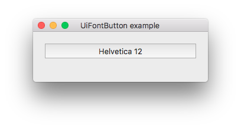

# FontButton

> A button that opens a font chooser.



```js
var libui = require('libui');

var win = new libui.UiWindow('UiFontButton example', 640, 480, true);

var widget = new libui.UiFontButton();
win.setChild(widget);

win.onClosing(function () {
	win.close();
	libui.stopLoop();
});

win.show();

libui.startLoop();

```

---

# Constructor

> new libui.UiFontButton()

Create a new UiFontButton object.

---

# Properties

See [properties implementation](properties.md) for generic details on how properties are implemented.


### font: FontDescriptor

Return or set the currently selected font (see [FontDescriptor](attributedstring.md#fontdescriptor)


---

# Methods


## destroy

Destroy and free the control.


## setParent

Change the parent of the control


**Arguments**

* parent: UiControl - the new parent of the widget or null to detach it.


## toplevel

Return whether the control is a top level one or not.


## getFont

Return the value of property `font`


---

# Events

See [events implementation](events.md) for generic details on how events are implemented.


### onChanged

Emitted whenever property `font` change.


