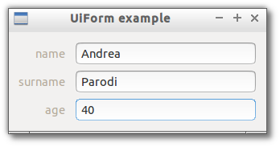

# Form

> A container that organize children as labeled fields.



```js

var libui = require('libui');

libui.Ui.init();
var win = new libui.UiWindow('UiForm example', 640, 480, true);

var widget = new libui.UiForm();
win.setChild(widget);

win.onClosing(function () {
	win.close();
	libui.stopLoop();
});

win.show();

libui.startLoop();

```

---

# Constructor

> new libui.UiForm()

Create a new UiForm object.

---

# Properties

See [properties implementation](properties.md) for generic details on how properties are implemented.


### visible: Boolean

Whether the widget should be visible or hidden. 
Read write.
Defaults to `true`.


### enabled: Boolean

Whether the widget should be enabled or disabled. 
Read write.
Defaults to `true`.


### padded: Boolean

If true, the container insert some space between children. 
Defaults to false.


---

# Methods


## append

Append a new child widget as last field with specified label.


**Arguments**

* label: String - the text to use as label of the field.
* control: UiControl - the control to append.
* stretchy: Boolean - whether the child should expand to use all available size.


## deleteAt

Remove a child widget and albel at specified position.


**Arguments**

* index: Number - the index of the control to remove.


## destroy

Destroy and free the control.


## setParent

Change the parent of the control


**Arguments**

* parent: UiControl - the new parent of the widget or null to detach it.


## toplevel

Return whether the control is a top level one or not.


## setVisible

Set the value of property `visible`

**Arguments**

* value: Boolean - The new value for `visible` property.

## getVisible

Return the value of property `visible`


## setEnabled

Set the value of property `enabled`

**Arguments**

* value: Boolean - The new value for `enabled` property.

## getEnabled

Return the value of property `enabled`


## setPadded

Set the value of property `padded`

**Arguments**

* value: Boolean - The new value for `padded` property.

## getPadded

Return the value of property `padded`


