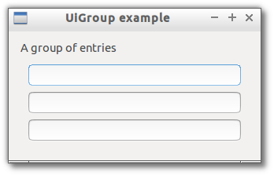

# Group

> A container for a single widget that provide a caption and visually group it's children.



```js

var libui = require('libui');

libui.Ui.init();
var win = new libui.UiWindow('UiGroup example', 640, 480, true);

var widget = new libui.UiGroup();
win.setChild(widget);

win.onClosing(function () {
	win.close();
	libui.stopLoop();
});

win.show();

libui.startLoop();

```

---

# Constructor

> new libui.UiGroup()

Create a new UiGroup object.

---

# Properties

See [properties implementation](properties.md) for generic details on how properties are implemented.


### visible: Boolean

Whether the widget should be visible or hidden. 
Read write.
Defaults to `true`.


### enabled: Boolean

Whether the widget should be enabled or disabled. 
Read write.
Defaults to `true`.


### margined: Boolean

This property specify if the group content area should have a margin or not.
Defaults to false.


### title: String

This property specify the caption of the group.
Defaults to empty string.


---

# Methods


## setChild

Set the child widget of the group.


**Arguments**

* control: UiControl - the control to append.


## destroy

Destroy and free the control.


## setParent

Change the parent of the control


**Arguments**

* parent: UiControl - the new parent of the widget or null to detach it.


## toplevel

Return whether the control is a top level one or not.


## setVisible

Set the value of property `visible`

**Arguments**

* value: Boolean - The new value for `visible` property.

## getVisible

Return the value of property `visible`


## setEnabled

Set the value of property `enabled`

**Arguments**

* value: Boolean - The new value for `enabled` property.

## getEnabled

Return the value of property `enabled`


## setMargined

Set the value of property `margined`

**Arguments**

* value: Boolean - The new value for `margined` property.

## getMargined

Return the value of property `margined`


## setTitle

Set the value of property `title`

**Arguments**

* value: String - The new value for `title` property.

## getTitle

Return the value of property `title`


