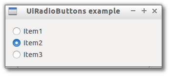

# RadioButtons

> A widget that represent a group of radio options.



```js

var libui = require('libui');

libui.Ui.init();
var win = new libui.UiWindow('UiRadioButtons example', 640, 480, true);

var widget = new libui.UiRadioButtons();
win.setChild(widget);

win.onClosing(function () {
	win.close();
	libui.stopLoop();
});

win.show();

libui.startLoop();

```

---

# Constructor

> new libui.UiRadioButtons()

Create a new UiRadioButtons object.

---

# Properties

See [properties implementation](properties.md) for generic details on how properties are implemented.


### visible: Boolean

Whether the widget should be visible or hidden. 
Read write.
Defaults to `true`.


### enabled: Boolean

Whether the widget should be enabled or disabled. 
Read write.
Defaults to `true`.


### selected: Number

Return or set the current choosed option by index.


---

# Methods


## append

Append a new radio option as last one with specified text.


**Arguments**

* text: String - the text to show as radio widget label.


## destroy

Destroy and free the control.


## setParent

Change the parent of the control


**Arguments**

* parent: UiControl - the new parent of the widget or null to detach it.


## toplevel

Return whether the control is a top level one or not.


## setVisible

Set the value of property `visible`

**Arguments**

* value: Boolean - The new value for `visible` property.

## getVisible

Return the value of property `visible`


## setEnabled

Set the value of property `enabled`

**Arguments**

* value: Boolean - The new value for `enabled` property.

## getEnabled

Return the value of property `enabled`


## setSelected

Set the value of property `selected`

**Arguments**

* value: Number - The new value for `selected` property.

## getSelected

Return the value of property `selected`


---

# Events

See [events implementation](events.md) for generic details on how events are implemented.


### onSelected

Emitted whenever property `selected` change.


