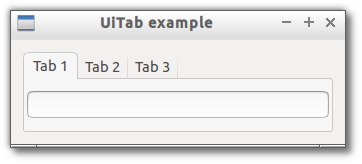

# Tab

> A container that show each chidren in a separate tab.



```js

var libui = require('libui');

libui.Ui.init();
var win = new libui.UiWindow('UiTab example', 640, 480, true);

var widget = new libui.UiTab();
win.setChild(widget);

win.onClosing(function () {
	win.close();
	libui.stopLoop();
});

win.show();

libui.startLoop();

```

---

# Constructor

> new libui.UiTab()

Create a new UiTab object.

---

# Properties

See [properties implementation](properties.md) for generic details on how properties are implemented.


### visible: Boolean

Whether the widget should be visible or hidden. 
Read write.
Defaults to `true`.


### enabled: Boolean

Whether the widget should be enabled or disabled. 
Read write.
Defaults to `true`.


---

# Methods


## append

Append a new child widget as last tab.


**Arguments**

* label: String - the text to show in the new tab caption.
* control: UiControl - the control to append.


## insertAt

Insert a new child widget before specified position.


**Arguments**

* label: String - the text to show in the new tab caption.
* before: Number - the control will be inserted before this position
* control: UiControl - the control to insert.


## deleteAt

Remove the tab and widget at specified position.


**Arguments**

* index: Number - the index of the tab to remove.


## setMargined

Specifies that a tab should use a margin around its content.


**Arguments**

* page: Number - the index of the tab.
* margined: Boolean - whether to display a margin or not.


## getMargined

Return a boolean that indicate if a tab is displaying a margin around its content.


**Arguments**

* page: Number - the index of the tab.


## numPages

Return the total number of tab pages contained in the widgets.


## destroy

Destroy and free the control.


## setParent

Change the parent of the control


**Arguments**

* parent: UiControl - the new parent of the widget or null to detach it.


## toplevel

Return whether the control is a top level one or not.


## setVisible

Set the value of property `visible`

**Arguments**

* value: Boolean - The new value for `visible` property.

## getVisible

Return the value of property `visible`


## setEnabled

Set the value of property `enabled`

**Arguments**

* value: Boolean - The new value for `enabled` property.

## getEnabled

Return the value of property `enabled`


