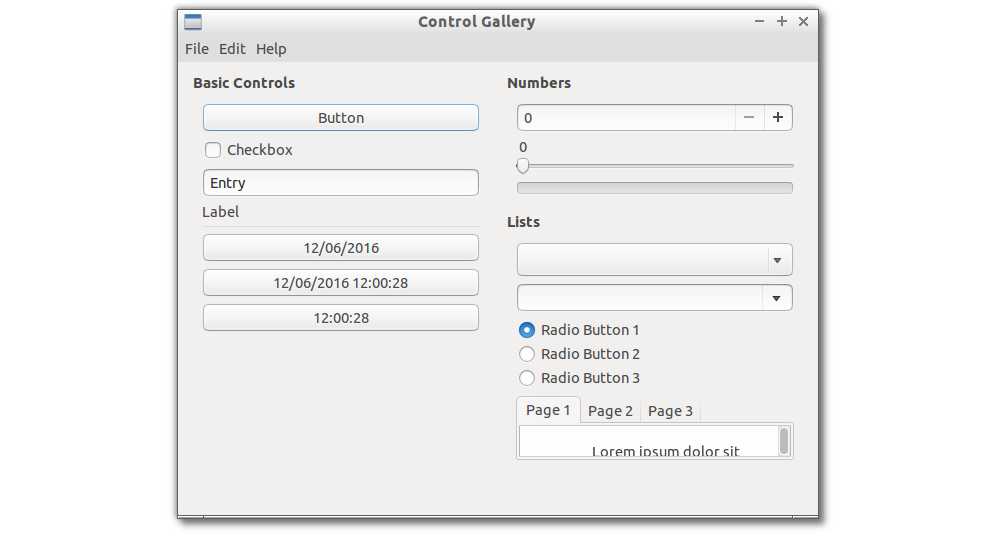
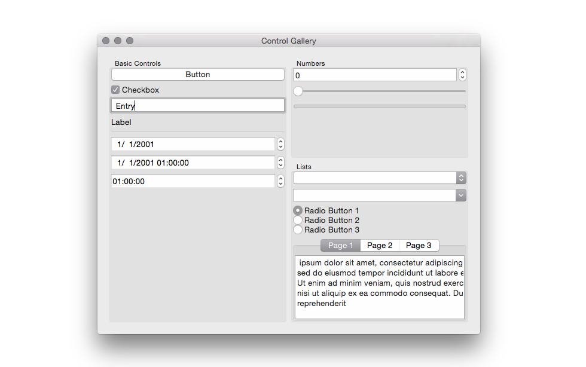
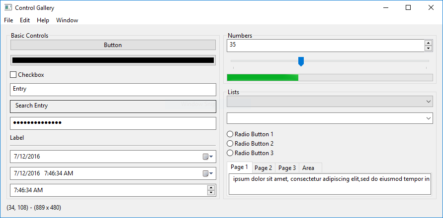

# libui-node

> libui Node.js bindings.

[](http://travis-ci.org/parro-it/libui-node)
[](https://ci.appveyor.com/project/parro-it/libui-node)
[](https://npmjs.org/package/libui-node)
[](https://npmjs.org/package/libui-node)

[libui](https://github.com/andlabs/libui) is a simple and portable (but not inflexible) GUI library in C that uses the native GUI technologies of each platform it supports.

It is in early stage of development, but is evolving at great pace and is really awesome.

It could become an awesome, lightweight alternative to Electron to develop multiplatform GUI.

**Linux**


**macOS**


**Windows**



# Supported platform

* Windows: Windows Vista SP2 with Platform Update or newer
* Unix: GTK+ 3.10 or newer
* Mac OS X: OS X 10.8 or newer

# Node version requirement

The project run on any node version > 0.12.

# Installation

We had published a first pre-release to npm.
You can now install `libui-node` as a simple dependency in your project:

```bash
npm install -S libui-node
```

`libui` prebuilt binaries are automatically downloaded after install.

This is tested with:

* Linux 64bit
* Linux 32bit
* Windows 64bit
* macOS

If you get error on windows, check [this node-gyp issue](https://github.com/nodejs/node-gyp/issues/972)


# Documentation

You can find ongoing documentation in [docs folder](docs).

Plase look in [examples folder](https://github.com/parro-it/libui-node/tree/master/examples) for working examples.

Some example uses ES6 syntax. We will soon configure babel transpilation for them. Meanwhile, if you are testing the project on Node.js < 6, you can check `examples/core-api.js` that use ES5 syntax.

# Run examples

First, you have to clone the GitHub repo and npm install it:

```bash
git clone https://github.com/parro-it/libui-node.git
npm install
```

Then, to run the control gallery example (requires Node.js >= 6), type:

```bash
npm start
```

For the core api, example, type:

```bash
npm run start-core
```

# Project status

* All current `libui` API, except for [these ones](https://github.com/parro-it/libui-node/issues?q=is%3Aissue+is%3Aopen+label%3A%22Missing+bind%22) are implemented.
* This is not yet battle-tested in a real app, but the control gallery example you saw in the screenshot above is fully working.


# Future directions of the project

This binding is actually implementing low-level API straight to the `libui` ones.
We plan to add another level of API on top of it to simplify GUI building. You can get a taste of how they will be in [example utils.js file](https://github.com/parro-it/libui-node/blob/master/examples/utils.js).

This new API will support transpilation from JSX to further simplify GUI building.

These works will become in future the base for a React-Native like project.

# Contribution & design

* Each `libui` widget implementaion is written in it's own C++ file in `src` folder.
* Each widget is implemented in it's own C++ class, each class is a simple wrapper for related libui C functions.
* There is an header file called `src/ui-node.h` that contains all classes definitions.
* Widget events does not follow `node` convention: if you attach an handler to an event, previous one will be overwritten and never be called. This will be resolved on future high-level API repo, where each widget will be an `EventEmitter` instance.
* We build the project using the awesome [nbind](https://github.com/charto/nbind) tool, that automate the process of linking a straight C++ class to Node.js stuff...

## Useful NPM scripts

* test - run AVA tests && XO linting.
* start - start the control gallery example
* build - rebuild C++ sources

## Related projects

* [libui](https://github.com/andlabs/libui) - Simple and portable (but not inflexible) GUI library in C that uses the native GUI technologies of each platform it supports.
* [nbind](https://github.com/charto/nbind) - Magical headers that make your C++ library accessible from JavaScript

# Contributors

[](https://github.com/parro-it) | [](https://github.com/jjrv) | [](https://github.com/mavenave)
---|---|---
[Andrea Parodi](https://github.com/parro-it) | [Juha Järvi](https://github.com/jjrv) | [Chan Guan Hao](https://github.com/mavenave)

# License

The MIT License (MIT)

Copyright (c) 2016 parro-it
